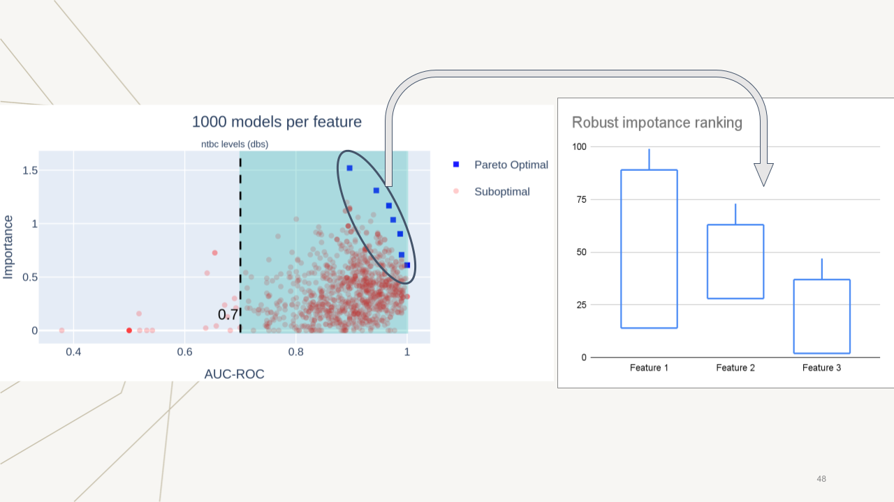

## IDENTIFICATION OF BIOMARKERS ASSOCIATED TO LIVER COMPLICATIONS IN TYROSINEMIC TYPE - 1 PATIENTS: A MULTICENTRIC MACHINE LEARNING APPROACH.

This project focuses on developing a model that generalizes the biochemical phenotype of (TYROSINEMIC TYPE - 1) patients with altered alpha-phetoprotein. The code comprises preprocessing, exploratory and predictive analysis of health data for two cohorts from Chile and Italy. The extracted data undergoes a series of operations, such as loading into a Pandas DataFrame, filtering, and saving, for subsequent usage. Furthermore, the project leverages a machine learning pipeline powered by XGBoost, Optuna, SHAP, and Ray libraries. The datasets showed predictive capacity enabling models to generalize the biochemical phenotype of type-1 tyrosinemia. Also, characterizing features in terms of their importance for predictions revealed different rankings depending on which test set was used.

## Project Structure
The project comprises two primary parts:

### Part 1: Data Preprocessing and Extraction

The `src/main.py` script hosts the operations for data extraction, processing, and saving.

1. **Logging Configuration:** Set up logging to record significant script execution events in the `workflow.log` file.
2. **Function Definitions:** Define `sheet_to_dataframe` and `compare_dataframes` for data extraction and comparison, respectively.
3. **Data Extraction:** Establish a connection to Google Sheets using the `gspread` package, extract datasets, and load them into DataFrames.
4. **Data Filtering:** After loading, select predefined features from each DataFrame and drop rows missing certain features.
5. **Data Saving:** Save the final cleaned DataFrames as CSV files in the `data/` directory.

### Part 2: XGBoost, Optuna and Ray-based Machine Learning Pipeline

This section incorporates Python classes and functions that streamline Machine Learning pipelines, with an emphasis on the XGBoost, Optuna, and Ray libraries.

## File Structure
- `src/main.py`: Main Python script.
- `credentials/project-30463-38031804e4b0.json`: Google Sheets service account credentials.
- `data/`: Directory for processed data saved as CSV files.

## Key Components

### Libraries Used

- **ray:** For distributed and parallel computing.
- **optuna:** A library for hyperparameter optimization.
- **xgboost:** A gradient boosting library providing a robust framework for constructing predictive models.
- **shap:** A library that uses Shapley values to interpret any machine learning model's output.

### Classes and Functions

- **DataImputer:** Imputes missing numerical values in a DataFrame.
- **DataSplitter:** Performs stratified splitting on a DataFrame.
- **ModelInstance:** Instantiates, trains, and evaluates a model.
- **objective():** Optimizes a model's performance and a given feature's importance.
- **make_a_study():** A Ray remote function that fine-tunes hyperparameters.
- **make_multiple_studies():** Runs multiple optuna studies for various features and targets.
- **launch_to_ray():** Applies the entire pipeline, from data preprocessing to hyperparameter optimization.